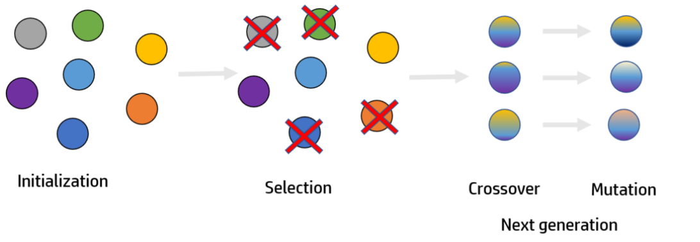

# Requisitos
Python 3.x
Bibliotecas: matplotlib, numpy, deap

# Utilização
Para executar o script, use o seguinte comando:

python ag.py 
python ag_pandas.py

# Descrição
Este é um script Python desenvolvido para otimizar a alocação de disciplinas em um calendário acadêmico usando algoritmos genéticos. Ele gera horários de aula para disciplinas com base em suas restrições de horário e pré-requisitos.

O script usa a biblioteca DEAP para implementar um algoritmo genético que gera e otimiza horários de aulas para um conjunto de disciplinas. Ele inclui as seguintes funcionalidades:

Avaliação de Horário: Verifica conflitos de horário entre disciplinas e pré-requisitos.
Inicialização da População: Gera uma população inicial de horários de aula.
Seleção, Cruzamento e Mutação: Aplica operadores genéticos para evoluir a população.
Estatísticas: Registra estatísticas sobre a evolução da população durante as gerações.
Visualização de Horários: Gera gráficos mostrando os horários das disciplinas antes e depois da otimização.

# Funções

gerar_horario(): Gera um cromossomo (horário) aleatório.
avaliar_horario(individuo): Avalia a adequação do horário em relação a conflitos.
inicializar_populacao(pop_size): Inicializa a população com horários aleatórios.
plot_horarios(cromossomo, label, otimizacao): Gera gráficos dos horários.
Operadores Genéticos: Seleção, cruzamento e mutação.
algoritmo_genetico(pop_size, n_gen): Executa o algoritmo genético.
criar_cromossomo(disciplinas, num_periodos, tamanho_periodo): Cria um cromossomo válido.
imprimir_horarios_finais(horarios_finais): Mostra os horários finais.

# Funcionamento
Gera um horário inicial aleatório.
Executa o algoritmo genético para otimização dos horários.
Mostra estatísticas da otimização.
Gera e exibe os horários otimizados após a execução do algoritmo genético.
Imprime os horários finais gerados.

